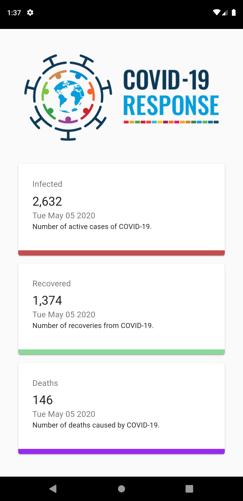

# Covid_19_Tracker

A Covid-19 Tracker Developed using React.Js. The Data has been Fetched using the API https://covid19.mathdro.id/api. 

react-chartjs-2 library is used for Line and Bar Graph visuals.

The Project also works as a Progressive Web App and can be added to Home Screen of the Mobile App.

Previous data is also shown for the Global data of Coronavirus Pandemic. This Application will help to keep a track of all the details of world Death, Infected and Recovered People.

There is also a Drop Down Menu from where any Countries data can be checked.

The Application is hosted at : https://covid-19-tracker.sharmakumaraditya.now.sh

# Desktop View of the Application

# Mobile View Of the Application

